# Paimon+Flink从0到1构建电商实时数据湖仓

## 1.简介

本项目是一个以电商为背景，采用Flink+Paimon构建的实时数据湖仓。

## 2.架构

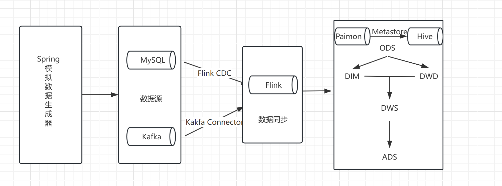

1)数据源：本项目通过Spring模拟数据生成器，分别生成日志以及业务数据。日志数据写入Kafka队列，业务数据写入MySQL数据库。

2)数据采集同步：本项目使用Java编写的FlinkSql代码实现数仓的搭建。日志数据->通过Flink的Kafka Connector对接，写入paimon表(HiveMetastore)的ODS原始数据层。业务数据->通过Flink CDC将MySQL中的业务数据同步到paimon表。

3)数仓分层：ODS(原始数据层)->DIM(维度层)->DWD(明细层)->DWS(汇总层)->ADS(应用层)

4)可视化：通过Doris Catalog对接paimon数据源，使用Superset进行可视化分析

## 3.版本

| 软件   | 版本   | 下载地址                                                     |
| ------ | ------ | ------------------------------------------------------------ |
| Flink  | 1.17.2 | https://mirrors.aliyun.com/apache/flink/flink-1.17.2/flink-1.17.2-bin-scala_2.12.tgz |
| Paimon | 0.8.0  | https://repo.maven.apache.org/maven2/org/apache/paimon/paimon-flink-1.17/0.8.0/paimon-flink-1.17-0.8.0.jar |
| Hadoop | 3.1.3  | https://archive.apache.org/dist/hadoop/common/hadoop-3.1.3/hadoop-3.1.3.tar.gz |
| Kafka  | 3.7.1  | https://mirrors.aliyun.com/apache/kafka/3.7.2/kafka_2.12-3.7.2.tgz |
| Doris  | 2.1.0  | https://apache-doris-releases.oss-accelerate.aliyuncs.com/apache-doris-2.1.0-bin-x64.tar.gz |
| JDK    | 8      |                                                              |
| MAVEN  | 3.9.9  | https://mirrors.aliyun.com/apache/maven/maven-3/3.9.11/binaries/apache-maven-3.9.11-bin.tar.gz |
| Hive   | 3.1.3  | https://mirrors.huaweicloud.com/apache/hive/hive-3.1.3/apache-hive-3.1.3-bin.tar.gz |

## 4.湖仓建设

1）ODS层建设

1. 日志数据->Kafka->Flink Kafka Connector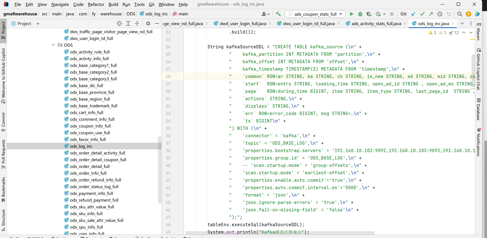

2. 业务数据->MySQL->Flink CDC

   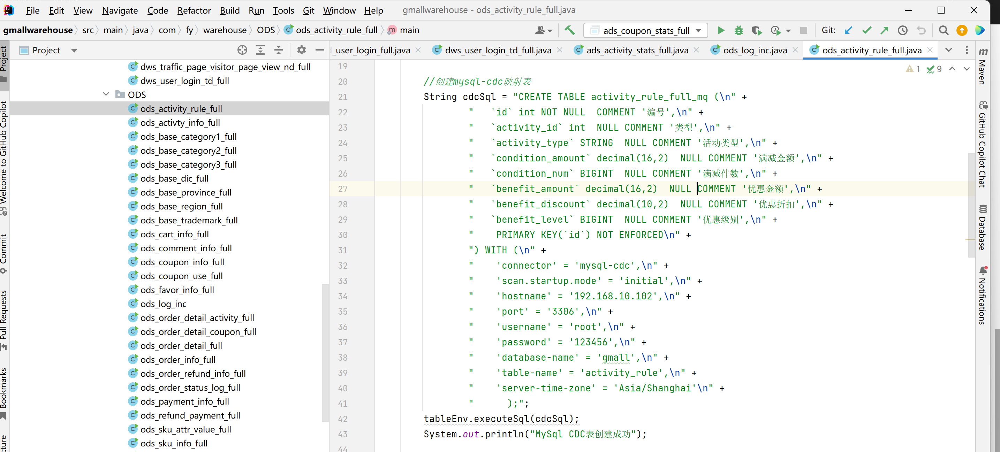

   

4. 元数据存储在Hive中，实际数据存储在HDFS，示例：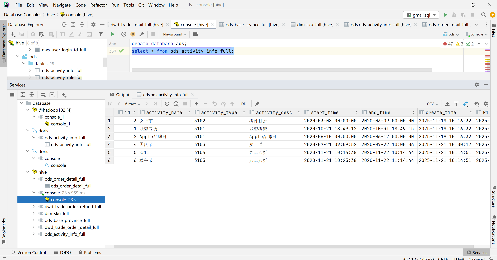

2）DIM层建设

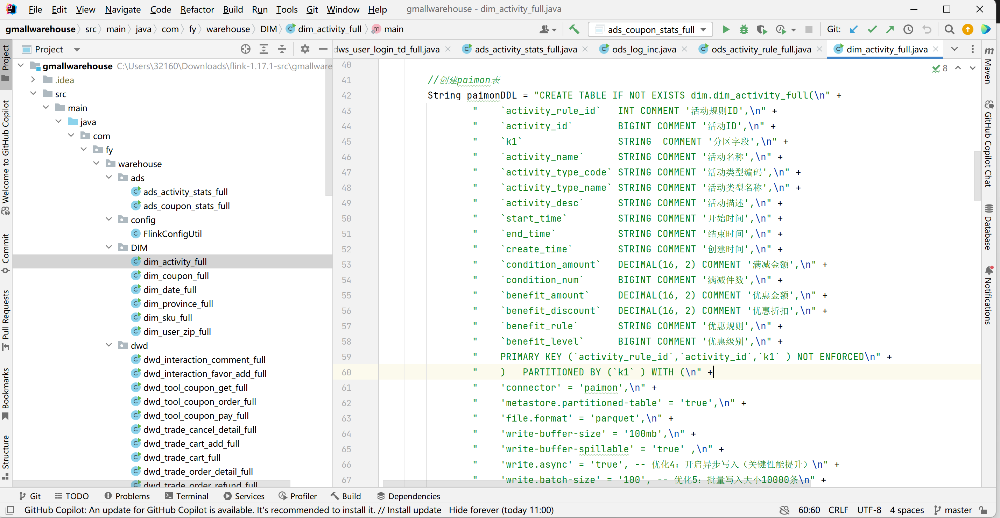

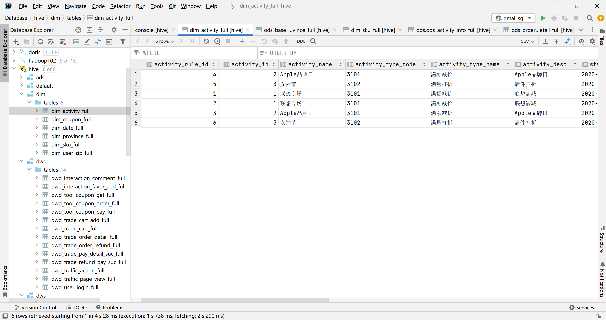

3）DWD层建设

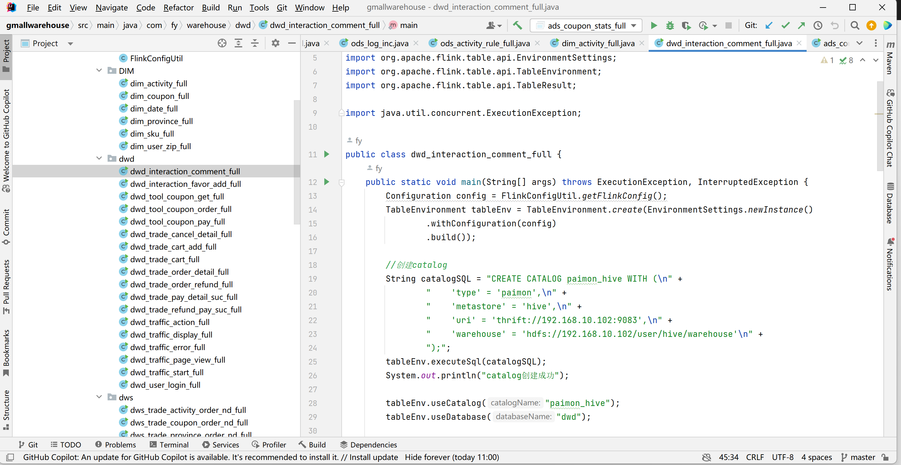

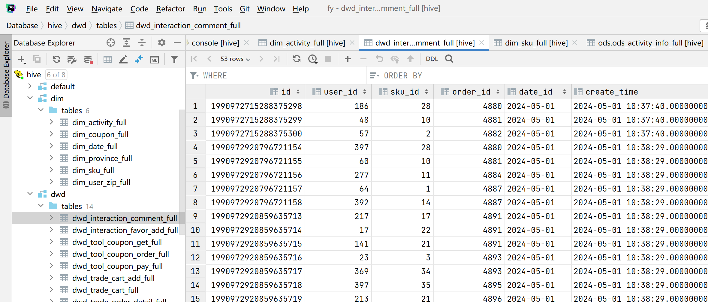

4）DWS层建设

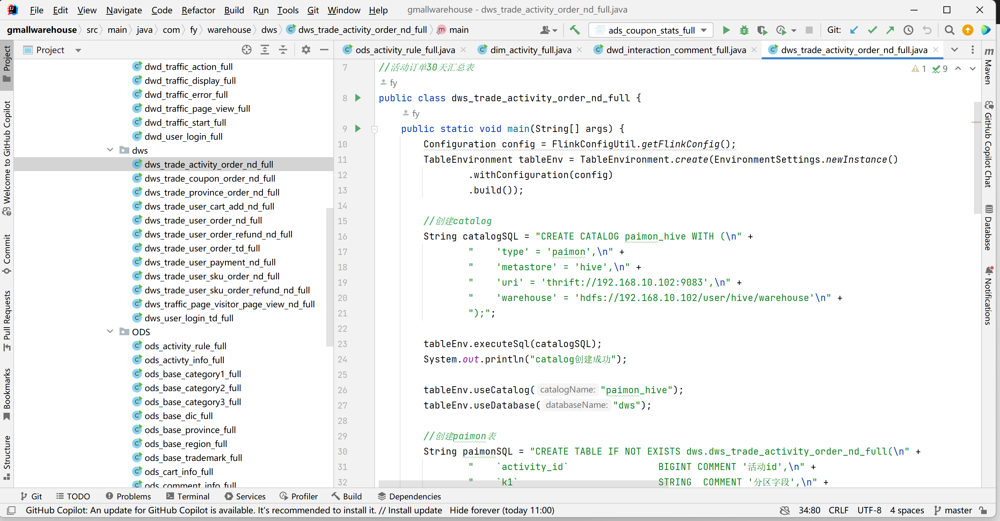

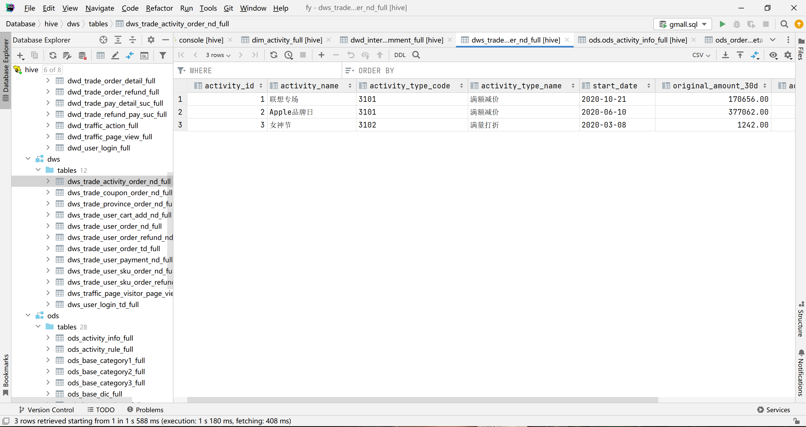

5）ADS层建设

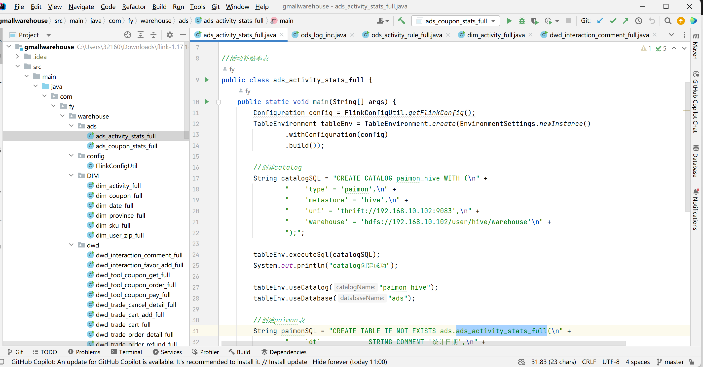

